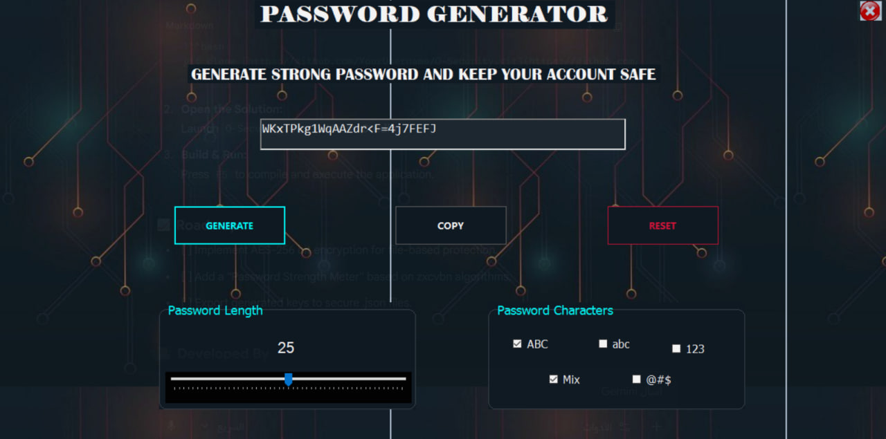

# <p align="center">🛡️ O-Security: Advanced Cryptographic Suite</p>

<p align="center">
  
  
  
  
</p>

---

## 📝 Overview
**O-Security** is a high-performance Windows utility engineered to bridge the gap between **industrial-grade security** and **high-fidelity UI design**. Developed by **Eng. Oday**, this suite implements advanced cryptographic principles to ensure data integrity and user privacy.

<p align="center">
  <kbd>
    
  </kbd>
  <br>
  <em>Figure 1: The "Neon-Noir" Glassmorphism Dashboard</em>
</p>

---

## ✨ Engineering Excellence

### 🔐 1. Cryptographically Secure Pseudo-Random Number Generator (CSPRNG)
* **High-Entropy Strings:** Utilizes system-level entropy for unpredictable password generation.
* **Character Set Filtering:** Granular control over `[A-Z]`, `[a-z]`, `[0-9]`, and `[Special_Symbols]`.
* **Zero-Trace Clipboard:** Automated memory flushing logic to prevent sensitive data leaks.

### 🛡️ 2. Symmetric Cryptography Core
* **Private-Key Orchestration:** Implements secure string-to-cipher transformations for sensitive data storage.
* **Integrity Focused:** Ensures that data remains confidential and tamper-proof.

---

## 🛠️ Technical Specifications
* **Core Language:** C# (Strongly Typed, OOP focus)
* **Platform:** .NET WinForms
* **Development Environment:** Visual Studio 2022 / 2026 Insider
* **UI Engine:** Custom GDI+ Rendering with Neon-Style Palettes

---

## 🚀 Deployment & Installation

### Local Setup
To run this project on your machine, execute the following commands in your terminal:

```bash
# Clone the official repository
git clone [https://github.com/Oday-Alnaqep-CS/PASSWORD_GENERAT.git](https://github.com/Oday-Alnaqep-CS/PASSWORD_GENERAT.git)

# Navigate to the project directory
cd PASSWORD_GENERAT

# Build the release version
dotnet build --configuration Release
